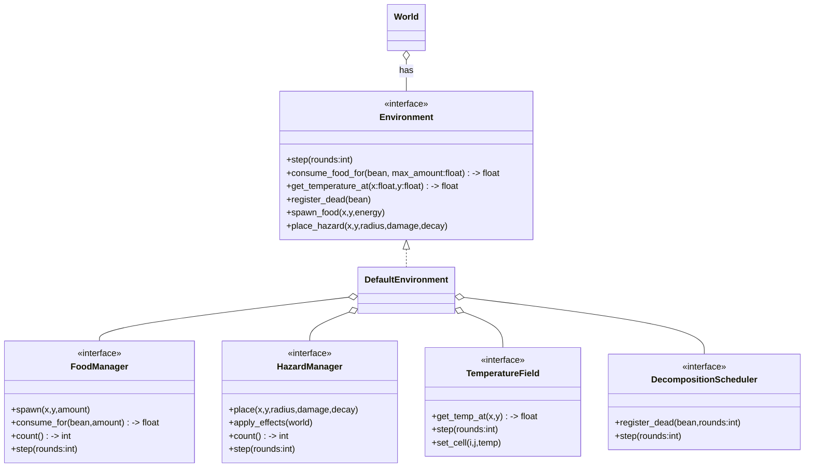

# Environment Subsystem Plan (comprehensive, config-first, TDD, git-safe)

## Purpose
This document defines a complete plan to add an Environment subsystem to the simulation. It includes:

- Manager interfaces and default implementations (Food, Hazard, Temperature, Decomposition)
- Environment interface and `DefaultEnvironment` implementation
- Three controllable randomness modes (random, seeded, explicit)
- Hybrid spatial model (cells for heatmaps, pixels for entities)
- Spawn-control and balancing algorithms to prevent shortages/overabundance
- TDD-first tests, phased implementation, and git-safe commit plan

The plan is conservative and designed to integrate with existing code (world, placement, energy system) and follow project rules (TDD, small commits, injected RNG for determinism).

---

## High-level goals & constraints
- TDD-first: write failing tests, implement the minimal code to satisfy them, iterate.
- Git-safe: small commits and branches; ask for commit approval per project procedures.
- Three randomness behaviors must be supported and selectable:
  - `random`: system RNG (non-deterministic by default)
  - `seeded`: deterministic behavior given a seed or seeded RNG
  - `explicit`: no randomness; items/fields are provided explicitly via config
- Managers are interface-driven with `Default*` implementations.
- `Environment.step()` must run at the start of each world tick (so environment updates apply during the same round).
- Hybrid spatial model:
  - Temperature: cell grid (configurable `cell_size` in pixels) with bilinear interpolation for per-pixel queries
  - Entities (Food, Hazard): precise pixel positions (use spatial indexing / `SpatialHash` for queries)

---

## Architecture & class responsibilities

Mermaid class diagram (render in GitHub or Mermaid-enabled editor):

Notes:
- Each manager has a default implementation (e.g., `DefaultFoodManager`) and can be replaced in tests.
- Managers accept a `RandomnessProvider` instance to control random/seeded/explicit behavior.

---

## Randomness & determinism

Introduce a `RandomnessProvider` abstraction with three implementations:

- `SystemRandomnessProvider()` — wraps `random` module for non-deterministic runs
- `SeededRandomnessProvider(seed_or_rng: int|random.Random)` — deterministic when given a seed or RNG instance
- `ExplicitProvider(values_iterable)` — yields values from a configured sequence (for explicit mode)

Provider API (minimal):
- `random() -> float`  # uniform in [0,1)
- `randint(a,b) -> int`
- `choice(seq)`
- `sample_positions(n, bounds) -> list[(x,y)]`
- `next_explicit()` (explicit provider helper)

Recommendation: use a single seeded RNG for the entire environment (or a deterministic RNG factory that yields substreams per manager) so ordering is reproducible across managers and tests.

---

## Config: `EnvironmentConfig` (fields and validation)
Add a new dataclass `EnvironmentConfig` in `src/config/loader.py` and return it from `load_config`:

- cell_size: int
- random_mode: str = "random"  # "random"|"seeded"|"explicit"
- environment_seed: Optional[int] = None
- food_density: float
- hazard_density: float
- food_spawn_rate_per_round: float
- hazard_spawn_rate_per_round: float
- decomposition_rounds: int
- decomposition_fraction_to_food: float (0..1)
- temp_min: float = 0.0
- temp_max: float = 100.0
- temperature_diffusion_rate: float
- temperature_migration_vector: tuple[float,float]
- temperature_variability: float
- temp_to_food_factor: float
- temp_to_metabolic_penalty: float
- hazard_decay_rate_per_hit: float
- explicit_food: Optional[list[dict]] = None
- explicit_hazards: Optional[list[dict]] = None
- explicit_temperature_grid: Optional[list[list[float]]] = None

Validation rules:
- `cell_size > 0`, densities ≥ 0, `decomposition_fraction_to_food` in [0,1], `random_mode` must be one of the three options.
- If `random_mode == "explicit"`: explicit lists for managers intended to be explicit must be present (partial explicit mode allowed; validate only supplied components).

Integrate `EnvironmentConfig` validation into `load_config` and return `(WorldConfig, BeansConfig, EnvironmentConfig)` so tests can assert presence.

---

## Spatial mapping: cells ⇄ pixels

- Mapping: `cell_x = floor(pixel_x / cell_size)`, `cell_y = floor(pixel_y / cell_size)`.
- Temperature lookup: bilinear interpolation between 4 surrounding cell centers for smooth per-pixel values.
- Use `SpatialHash` or similar for efficient proximity queries (food/hazard lookups near beans).

---

## Semantics & formulas

Food:
- Spawned food nutrient: `nutrient = base_food_energy * (1 + (temp - temp_min)/(temp_max - temp_min) * temp_to_food_factor)` — warmer regions produce richer food.
- Dead-bean food: `dead_nutrient = decomposition_fraction * bean_energy` (dead food is weaker than spawned food).

Decomposition:
- `register_dead(bean)` schedules food spawn after `decomposition_rounds` at bean location or nearby; nutrient computed via dead_nutrient formula.

Hazards:
- Each hazard has `damage_per_contact` and `remaining_potency`.
- On hit: `remaining_potency -= decay_rate_per_hit`; remove hazard when `remaining_potency <= 0`.
- Hazards can spawn stochastically (spawn rate) controlled by provider.

Temperature dynamics:
- Each `step`: apply diffusion (neighbor averaging * diffusion_rate), migration/advection along `migration_vector`, and small noise (`temperature_variability`).
- Ensure values remain within `[temp_min, temp_max]`.
- Temperature affects metabolism via `metabolism_multiplier = 1 + temp_to_metabolic_penalty * (temp / temp_max)`; scale by `size_factor` for larger/fatter beans.

Spawn-control:
- Target counts: `target = world_area * density`.
- Each step compute `desired = target - current_count`; spawn up to `min(spawn_rate, max(0, desired))`, using RNG for stochastic variation if applicable.
- If `current_count > target + tolerance`, either skip spawn or remove inert items (configurable policy).

---

## Tests (TDD-first: exact test names)

1) Config tests
- `tests/test_config_loader.py::test_load_config_returns_environment_config`
- `tests/test_config_loader.py::test_environment_config_validation_explicit_requires_values`

2) RandomnessProvider tests
- `tests/test_randomness_provider.py::test_seeded_provider_is_reproducible`
- `tests/test_randomness_provider.py::test_explicit_provider_returns_values_in_order_and_raises_when_exhausted`

3) FoodManager tests
- `tests/test_environment_food.py::test_food_spawn_seeded_deterministic`
- `tests/test_environment_food.py::test_food_spawn_explicit_matches_config`
- `tests/test_environment_food.py::test_consumption_reduces_food_and_increases_bean_energy`

4) HazardManager tests
- `tests/test_environment_hazard.py::test_hazard_spawn_seeded_deterministic`
- `tests/test_environment_hazard.py::test_hazard_decays_and_is_removed_on_potency_zero`
- `tests/test_environment_hazard.py::test_hazard_spawn_explicit_matches_config`

5) TemperatureField tests
- `tests/test_environment_temperature.py::test_temperature_field_seeded_evolution_is_reproducible`
- `tests/test_environment_temperature.py::test_temperature_field_explicit_grid_is_used_exactly`

6) Integration tests
- `tests/test_survival_integration.py::test_world_with_seeded_environment_is_deterministic`
- `tests/test_survival_integration.py::test_world_with_explicit_environment_matches_expected_layout`

All tests should inject seeded RNGs or explicit providers where appropriate for determinism.

---

## Implementation phases (git-safe, TDD, small commits)

Branch: `feature/environment-subsystem`

Phase 1 — Config & tests (small)
- Add `EnvironmentConfig` and associated tests (failing tests first). Update `load_config` to return the new config.

Phase 2 — RandomnessProvider + tests
- Add `src/beans/environment/randomness.py` with `RandomnessProvider` and `System`/`Seeded`/`Explicit` providers.

Phase 3 — Environment interface & skeleton
- Add `src/beans/environment/__init__.py` (interface) and a `DefaultEnvironment` skeleton; wire factory to create environment using provider per `EnvironmentConfig`.

Phase 4 — Implement managers incrementally (food, decomposition, hazard, temperature)
- For each manager: write failing unit tests, implement default manager, ensure it accepts provider and obeys modes (random/seeded/explicit).

Phase 5 — Spawn-control & integration
- Implement spawn control algorithm, add integration tests validating deterministic seeded runs and explicit layouts.

Phase 6 — Polish, performance, docs
- Add summaries in `summaries/` (ADR-style), mermaid diagram file, and finalize tests and documentation.

Commit and test after each phase; request approval before moving to next phase (per repository guidelines).

---

## Make & environment notes

- `Makefile` already has `test`, `test-specific`, and `test-sequence` targets. Use `make test-specific TEST_SPECIFIC=path` to run new tests quickly.
- Ensure a proper Python environment is active (use `pip install -e .` or `pip install -e "[dev]"` from `Makefile` before running tests).
- Use deterministic seeded RNG during tests via `random.Random(seed)` passed to providers.

---

## Next actionable step (recommended)
Start with Phase 1 (Config-first): I'll

1. Create branch `feature/environment-subsystem` (ensuring working tree is clean)
2. Commit this revised plan file to the branch (message: "docs: add environment subsystem plan (config-first, TDD)")
3. Add failing tests in `tests/test_config_loader.py` (or `tests/test_environment_config.py`) to assert presence and validation of `EnvironmentConfig`
4. Run `make test` to show failing tests and then implement minimal `EnvironmentConfig` parsing and validation in `src/config/loader.py` to make them pass

If you approve, I'll perform these steps and show the test output and commits.

---

*End of plan*
