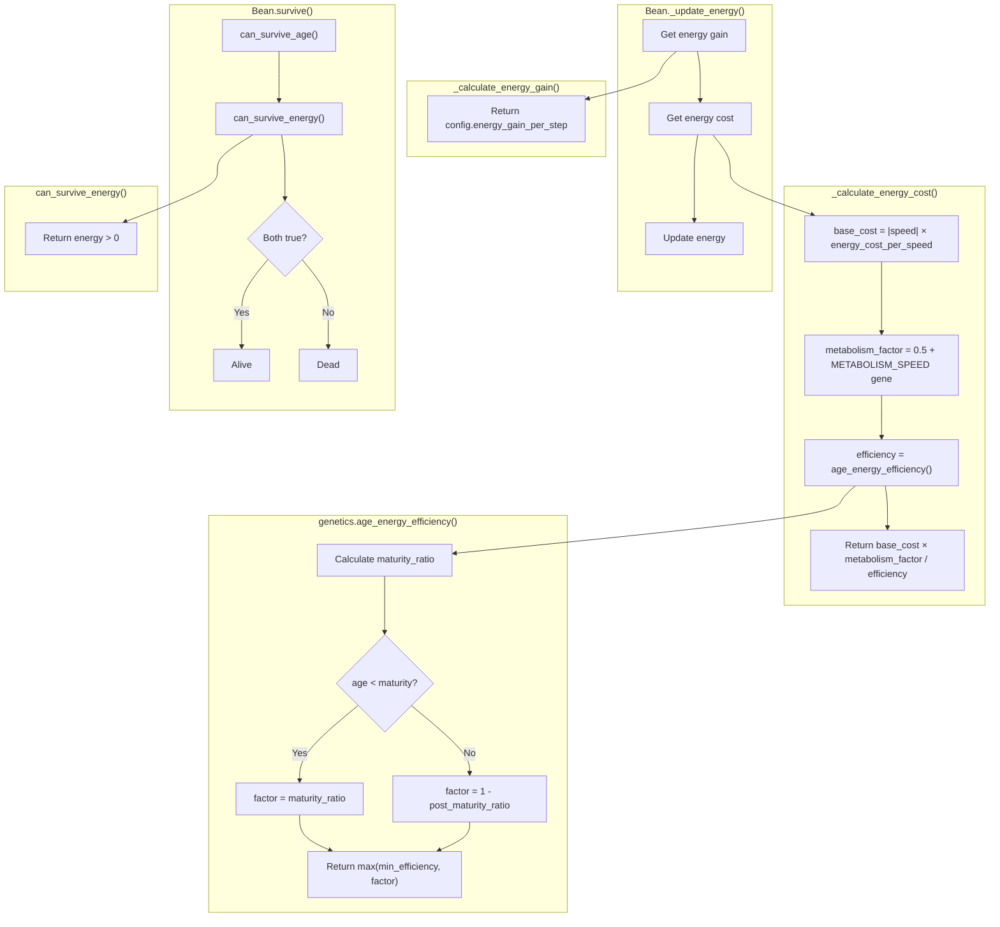

# Energy System Refactoring Diagram

```mermaid
flowchart TD
    subgraph Bean["Bean._update_energy()"]
        A["Get energy gain"] --> B["Get energy cost"]
        B --> C["Update energy"]
    end

    subgraph Gain["_calculate_energy_gain()"]
        D["Return config.energy_gain_per_step"]
    end

    subgraph Cost["_calculate_energy_cost()"]
        E["base_cost = |speed| × energy_cost_per_speed"]
        E --> F["metabolism_factor = 0.5 + METABOLISM_SPEED gene"]
        F --> G["efficiency = age_energy_efficiency()"]
        G --> H["Return base_cost × metabolism_factor / efficiency"]
    end

    subgraph Genetics["genetics.age_energy_efficiency()"]
        I["Calculate maturity_ratio"]
        I --> J{"age < maturity?"}
        J -->|Yes| K["factor = maturity_ratio"]
        J -->|No| L["factor = 1 - post_maturity_ratio"]
        K --> M["Return max(min_efficiency, factor)"]
        L --> M
    end

    A --> D
    B --> E
    G --> I

    subgraph Survival["Bean.survive()"]
        N["can_survive_age()"] --> O["can_survive_energy()"]
        O --> P{"Both true?"}
        P -->|Yes| Q["Alive"]
        P -->|No| R["Dead"]
    end

    subgraph CanSurviveEnergy["can_survive_energy()"]
        S["Return energy > 0"]
    end

    O --> S
```
