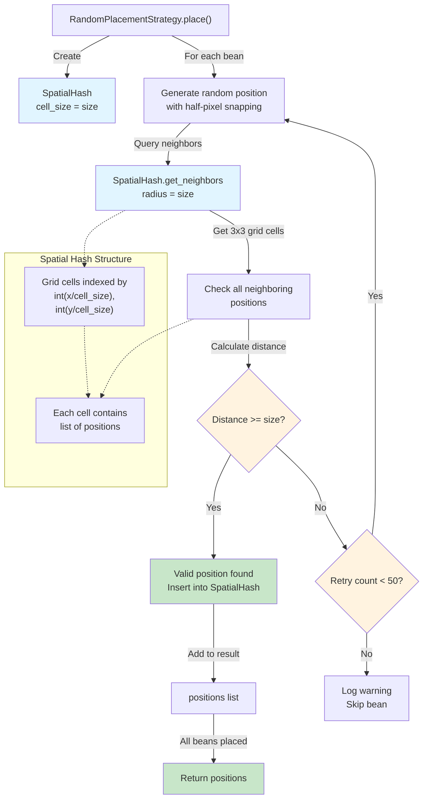

```mermaid
graph TD
    A["RandomPlacementStrategy.place()"] -->|Create| B["SpatialHash<br/>cell_size = size"]
    
    A -->|For each bean| C["Generate random position<br/>with half-pixel snapping"]
    
    C -->|Query neighbors| D["SpatialHash.get_neighbors<br/>radius = size"]
    
    D -->|Get 3x3 grid cells| E["Check all neighboring<br/>positions"]
    
    E -->|Calculate distance| F{"Distance >= size?"}
    
    F -->|Yes| G["Valid position found<br/>Insert into SpatialHash"]
    G -->|Add to result| H["positions list"]
    
    F -->|No| I{"Retry count < 50?"}
    I -->|Yes| C
    I -->|No| J["Log warning<br/>Skip bean"]
    
    H -->|All beans placed| K["Return positions"]
    
    subgraph "Spatial Hash Structure"
        L["Grid cells indexed by<br/>int(x/cell_size),<br/>int(y/cell_size)"]
        M["Each cell contains<br/>list of positions"]
        L -.-> M
    end
    
    D -.-> L
    E -.-> M
    
    style B fill:#e1f5ff
    style D fill:#e1f5ff
    style F fill:#fff3e0
    style I fill:#fff3e0
    style G fill:#c8e6c9
    style K fill:#c8e6c9
```