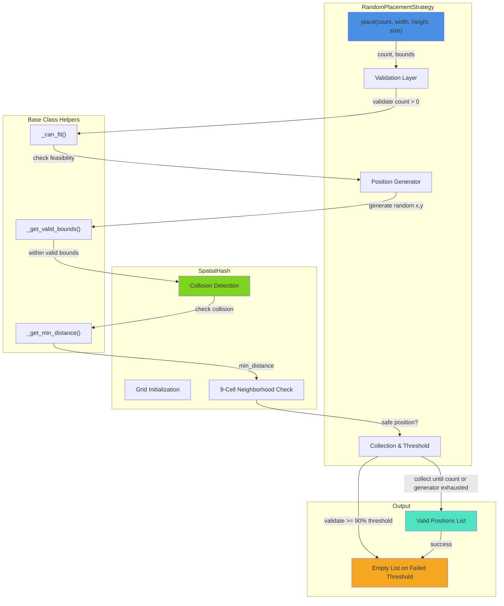
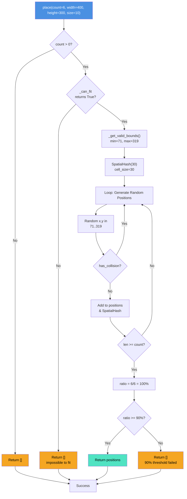
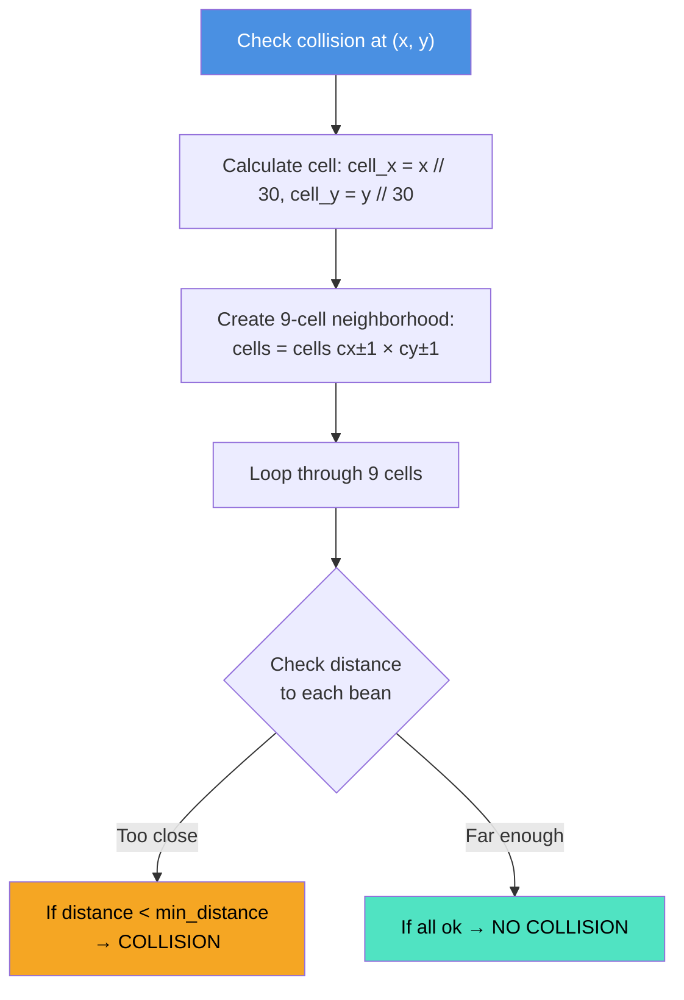
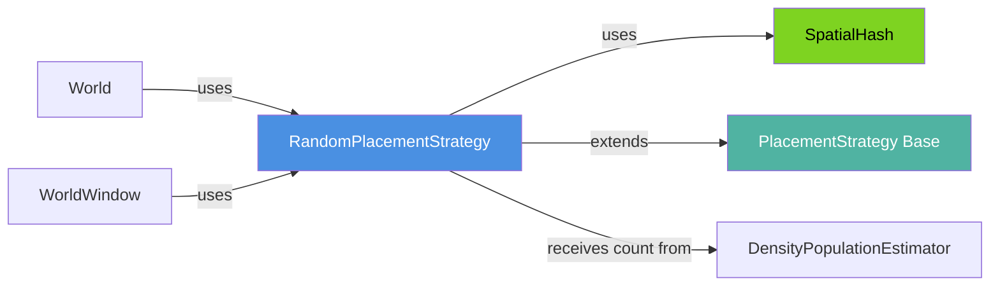

## Placement Algorithm Flow



## SpatialHash Collision Detection



## Performance Characteristics

```mermaid
xyChart
    title "Placement Performance vs Population"
    x-axis [6, 150, 1200]
    y-axis "Placement Rate (beans/sec)" 0 --> 250000
    line [28558, 105308, 228397]
```

## Data Structure: SpatialHash Example

```
Configuration: 400×300 world, bean size=10, 6 beans to place

Cell Size: 10 × 3 = 30
Grid: ~14×10 cells (400/30 × 300/30)

Example State After 3 Placements:
┌─────────────────────────────────────────┐
│  Grid cells with bean centers           │
├─────────────────────────────────────────┤
│                                         │
│  [1][2][3][4][5]...[13]                 │
│  [1][2]●(86,91)[4]...                   │ ← (2,3): bean 1
│  [1][2][3]●(115,95)...                  │ ← (3,3): bean 2
│  [1][2][3][4]●(141,105)...              │ ← (4,3): bean 3
│  ...                                    │
│  [1][2][3][4][5]...[13]                 │
│                                         │
└─────────────────────────────────────────┘

SpatialHash Dictionary:
{
  (2, 3): [(86, 91)],           # cell (2,3) contains bean at (86,91)
  (3, 3): [(115, 95)],          # cell (3,3) contains bean at (115,95)
  (4, 3): [(141, 105)],         # cell (4,3) contains bean at (141,105)
}

Collision Check at (150, 100):
→ Target cell: (5, 3)
→ Check 9 cells: (4,2) (5,2) (6,2) (4,3) (5,3) (6,3) (4,4) (5,4) (6,4)
→ Found bean at (141, 105) in cell (4,3)
→ Distance: sqrt((150-141)² + (100-105)²) = sqrt(81+25) = 10.3
→ Required: size + PIXEL_DISTANCE = 10 + 1 = 11
→ 10.3 < 11 → COLLISION → skip this position
```

## Component Dependencies


