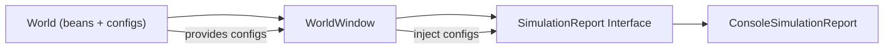

```mermaid
graph LR
    World["World (beans + configs)"] --> WorldWindow[WorldWindow]
    WorldWindow --> Reporter["SimulationReport Interface"]
    Reporter --> Console[ConsoleSimulationReport]
    WorldWindow -->|inject configs| Reporter
    World -->|provides configs| WorldWindow
```
