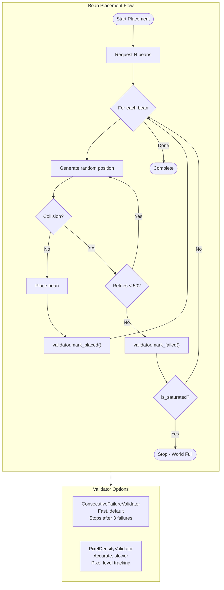

```mermaid
flowchart TB
    subgraph Placement["Bean Placement Flow"]
        direction TB
        Start([Start Placement]) --> Request["Request N beans"]
        Request --> Loop{For each bean}
        Loop --> Generate["Generate random position"]
        Generate --> Collision{Collision?}
        Collision -->|No| Place["Place bean"]
        Place --> MarkValid["validator.mark_placed()"]
        MarkValid --> Loop
        Collision -->|Yes| Retry{Retries < 50?}
        Retry -->|Yes| Generate
        Retry -->|No| MarkFail["validator.mark_failed()"]
        MarkFail --> Saturated{is_saturated?}
        Saturated -->|No| Loop
        Saturated -->|Yes| Stop([Stop - World Full])
        Loop -->|Done| Complete([Complete])
    end

    subgraph Validators["Validator Options"]
        direction LR
        CF["ConsecutiveFailureValidator<br/>Fast, default<br/>Stops after 3 failures"]
        PD["PixelDensityValidator<br/>Accurate, slower<br/>Pixel-level tracking"]
    end

    Placement -.-> Validators
```
