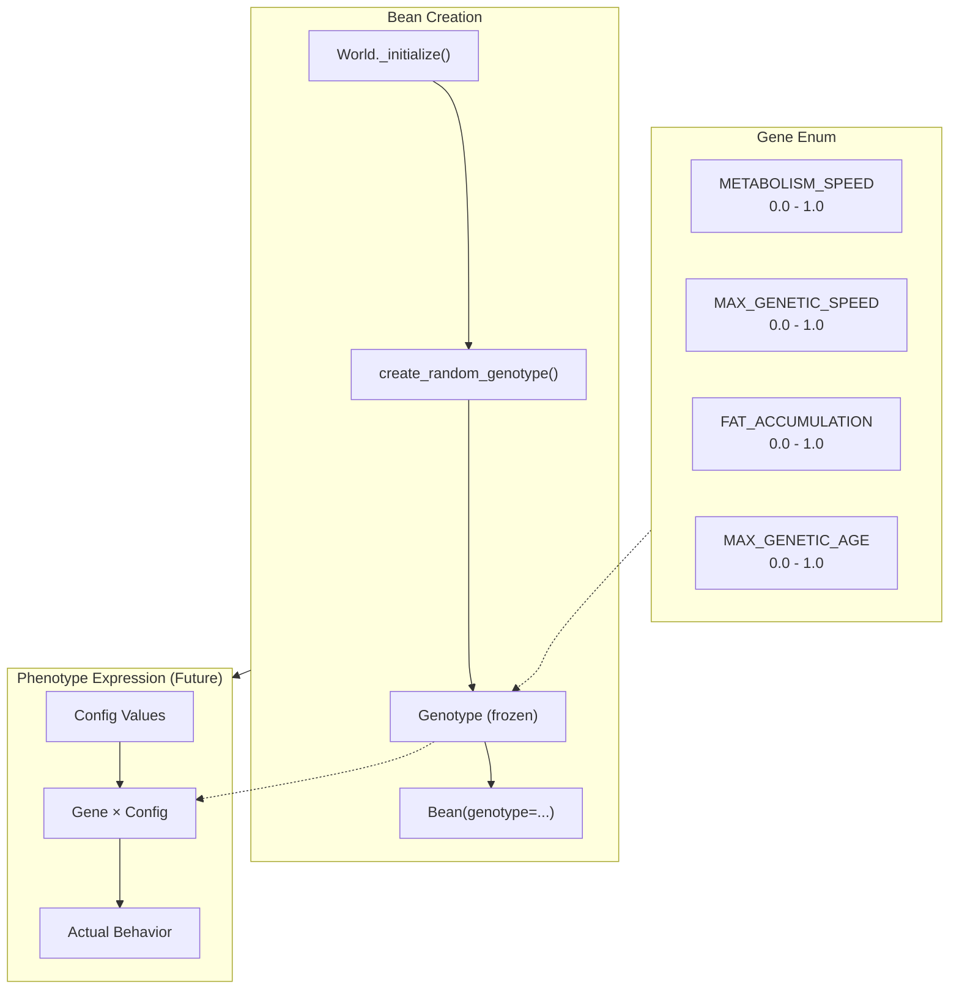

```mermaid
flowchart TB
    subgraph Creation["Bean Creation"]
        direction TB
        World["World._initialize()"] --> Factory["create_random_genotype()"]
        Factory --> Genotype["Genotype (frozen)"]
        Genotype --> Bean["Bean(genotype=...)"]
    end

    subgraph GeneEnum["Gene Enum"]
        direction LR
        G1["METABOLISM_SPEED<br/>0.0 - 1.0"]
        G2["MAX_GENETIC_SPEED<br/>0.0 - 1.0"]
        G3["FAT_ACCUMULATION<br/>0.0 - 1.0"]
        G4["MAX_GENETIC_AGE<br/>0.0 - 1.0"]
    end

    subgraph Future["Phenotype Expression (Future)"]
        direction TB
        Config["Config Values"] --> Multiply["Gene × Config"]
        Genotype -.-> Multiply
        Multiply --> Phenotype["Actual Behavior"]
    end

    Creation --> Future
    GeneEnum -.-> Genotype
```
