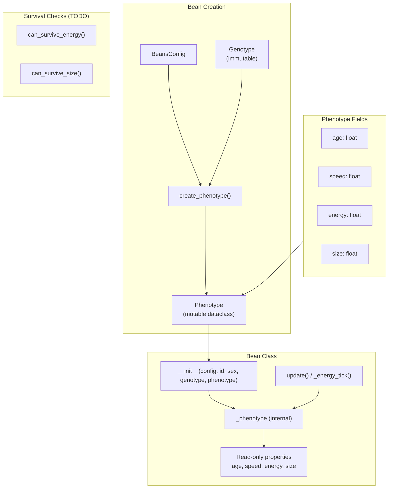

# Phenotype System Diagram

```mermaid
flowchart TB
    subgraph Creation["Bean Creation"]
        direction TB
        Config["BeansConfig"]
        Genotype["Genotype<br/>(immutable)"]
        Factory["create_phenotype()"]
        Phenotype["Phenotype<br/>(mutable dataclass)"]
        
        Config --> Factory
        Genotype --> Factory
        Factory --> Phenotype
    end
    
    subgraph PhenotypeFields["Phenotype Fields"]
        direction LR
        Age["age: float"]
        Speed["speed: float"]
        Energy["energy: float"]
        Size["size: float"]
    end
    
    subgraph BeanClass["Bean Class"]
        direction TB
        Init["__init__(config, id, sex, genotype, phenotype)"]
        Props["Read-only properties<br/>age, speed, energy, size"]
        Update["update() / _energy_tick()"]
        Internal["_phenotype (internal)"]
        
        Init --> Internal
        Internal --> Props
        Update --> Internal
    end
    
    subgraph Survival["Survival Checks (TODO)"]
        direction LR
        CanEnergy["can_survive_energy()"]
        CanSize["can_survive_size()"]
    end
    
    Phenotype --> Init
    PhenotypeFields --> Phenotype
```
