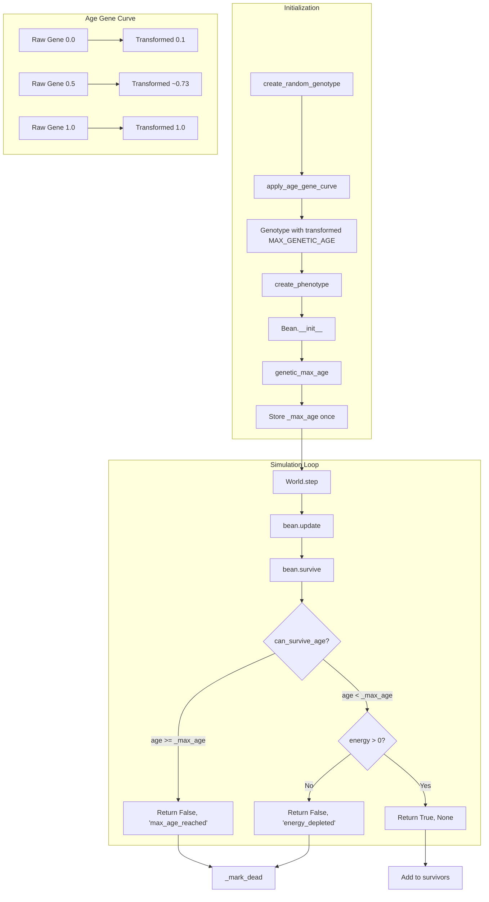

```mermaid
flowchart TB
    subgraph Initialization
        direction TB
        A[create_random_genotype] --> B[apply_age_gene_curve]
        B --> C[Genotype with transformed MAX_GENETIC_AGE]
        C --> D[create_phenotype]
        D --> E[Bean.__init__]
        E --> F[genetic_max_age]
        F --> G["Store _max_age once"]
    end

    subgraph "Simulation Loop"
        direction TB
        H[World.step] --> I[bean.update]
        I --> J[bean.survive]
        J --> K{can_survive_age?}
        K -->|age >= _max_age| L["Return False, 'max_age_reached'"]
        K -->|age < _max_age| M{energy > 0?}
        M -->|No| N["Return False, 'energy_depleted'"]
        M -->|Yes| O["Return True, None"]
    end

    subgraph "Age Gene Curve"
        direction LR
        P["Raw Gene 0.0"] --> Q["Transformed 0.1"]
        R["Raw Gene 0.5"] --> S["Transformed ~0.73"]
        T["Raw Gene 1.0"] --> U["Transformed 1.0"]
    end

    G --> H
    L --> V[_mark_dead]
    N --> V
    O --> W[Add to survivors]
```
