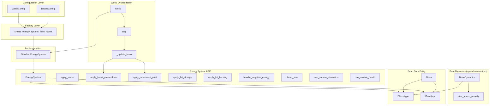
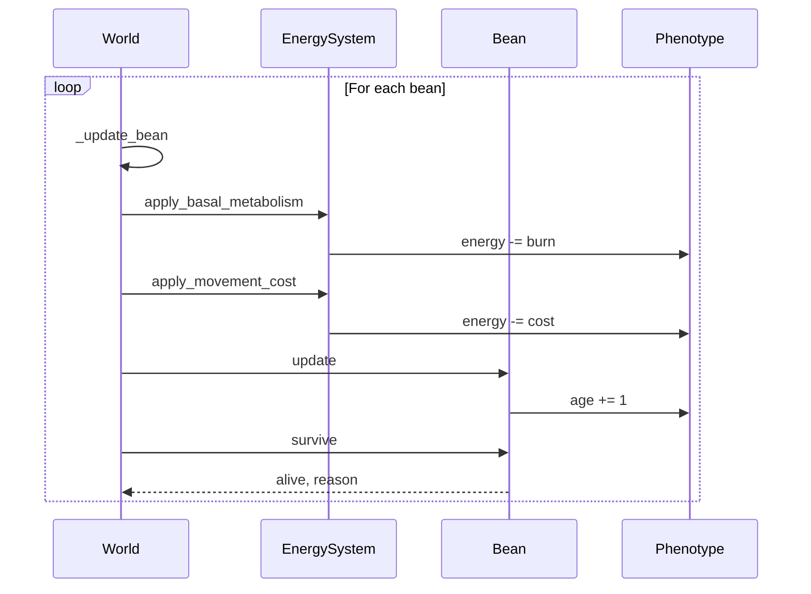

# Pluggable Energy System - Architecture Diagram

## Key Relationships

| From | To | Relationship |
|------|-----|--------------|
| WorldConfig | Factory | Provides energy system name |
| BeansConfig | Factory | Provides configuration parameters |
| Factory | StandardEnergySystem | Creates instance |
| StandardEnergySystem | EnergySystem | Implements interface |
| World | StandardEnergySystem | Owns and orchestrates |
| EnergySystem | Phenotype | Modifies energy, size |
| EnergySystem | Genotype | Reads gene values |

## Update Loop Sequence

