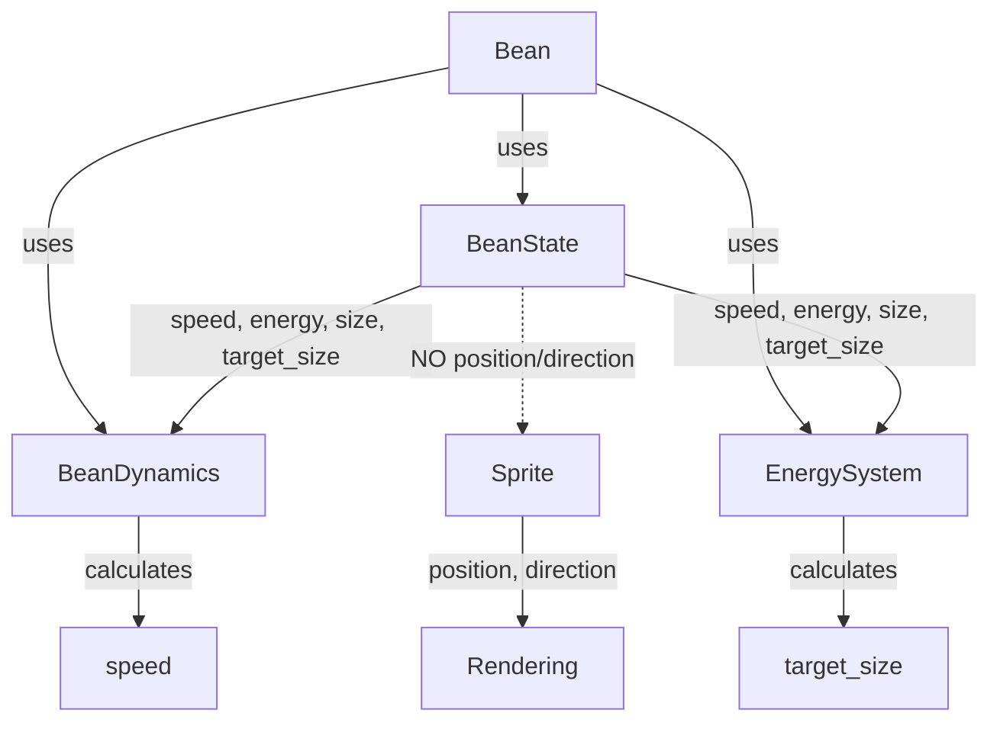

```mermaid
graph TD
    BeanState -- speed, energy, size, target_size --> BeanDynamics
    BeanState -- speed, energy, size, target_size --> EnergySystem
    EnergySystem -- calculates --> target_size
    BeanDynamics -- calculates --> speed
    Bean -- uses --> BeanState
    Bean -- uses --> BeanDynamics
    Bean -- uses --> EnergySystem
    BeanState -.->|NO position/direction| Sprite
    Sprite -- position, direction --> Rendering
```
