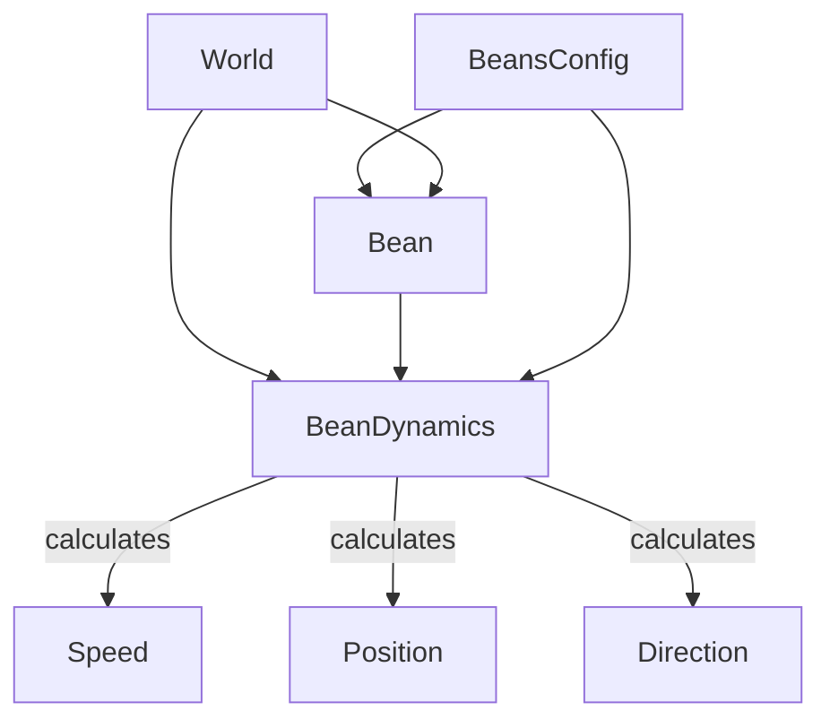

# 2025-12-09-bean-dynamics-system-diagram.md

```mermaid
graph TD
    World --> BeanDynamics
    Bean --> BeanDynamics
    BeanDynamics -->|calculates| Speed
    BeanDynamics -->|calculates| Position
    BeanDynamics -->|calculates| Direction
    BeansConfig --> BeanDynamics
    BeansConfig --> Bean
    World --> Bean
```

*BeanDynamics is called by both World and Bean to calculate movement parameters, using configuration from BeansConfig.*
