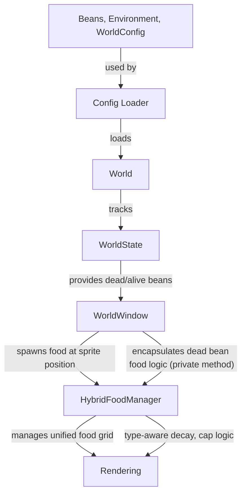

# 2025-12-20-food-spawning-system-integration-diagram.md

```mermaid
graph TD
    A[World] -- tracks --> B[WorldState]
    B -- provides dead/alive beans --> C[WorldWindow]
    C -- spawns food at sprite position --> D[HybridFoodManager]
    D -- manages unified food grid --> E[Rendering]
    C -- encapsulates dead bean food logic (private method) --> D
    F[Config Loader] -- loads --> A
    G[Beans, Environment, WorldConfig] -- used by --> F
    D -- type-aware decay, cap logic --> E
```

This diagram shows the decoupled architecture for food and dead bean food spawning, state tracking, and rendering.
